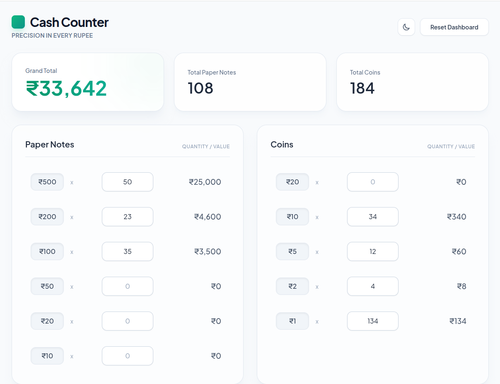
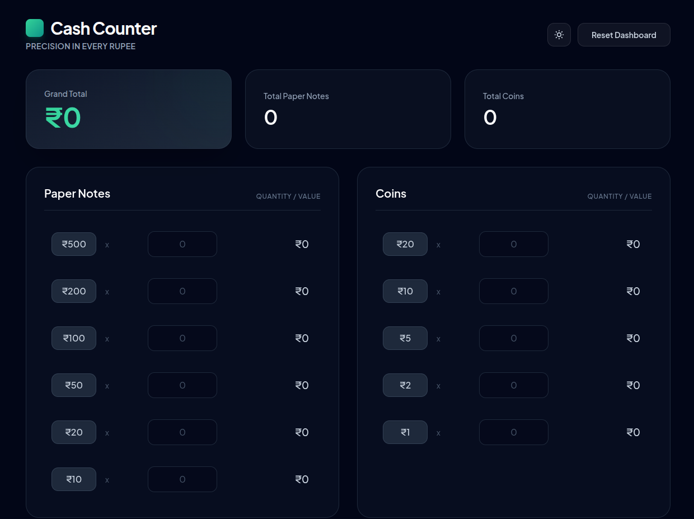

# 🪙 Cash Counter 
**Precision in Every Rupee.**


A high-end, production-ready web application designed for rapid, real-time currency calculation. Built with a lightweight Python backend and a highly responsive, glassmorphism-inspired frontend, Cash Counter is optimized for Indian Rupee (INR) denominations, separating paper notes and coins for maximum accuracy.

---

## ✨ Key Features

* **⚡ Real-Time Calculation:** Vanilla JavaScript engine updates totals instantly as you type. No page reloads or submit buttons required.
* **🌓 Premium UI/UX:** Features a modern glassmorphism aesthetic with seamless Light and Dark mode toggling. User theme preferences are saved locally via `localStorage`.
* **📊 Segregated Dashboard:** Independently tracks total paper notes, total coins, and calculates a combined Grand Total.
* **🛡️ Production Ready:** Configured with a Gunicorn WSGI server and fully Dockerized for immediate, secure deployment.

---

## 🛠️ Tech Stack

* **Frontend:** HTML5, Tailwind CSS (via CDN), Vanilla JavaScript, Google Fonts (*Plus Jakarta Sans*)
* **Backend:** Python 3.9, Flask 3.0.0, Gunicorn
* **Deployment:** Docker, Dockerfile

---

## 📂 Project Structure

```text
cash_counter/
│
├── app.py                 # Flask server initialization
├── requirements.txt       # Python dependencies (Flask, Gunicorn)
├── Dockerfile             # Production Docker configuration
└── templates/
    └── index.html         # Frontend UI & JavaScript logic
```

## 📸 Screenshots

<p align="center">
  
  &nbsp;
  
</p>
